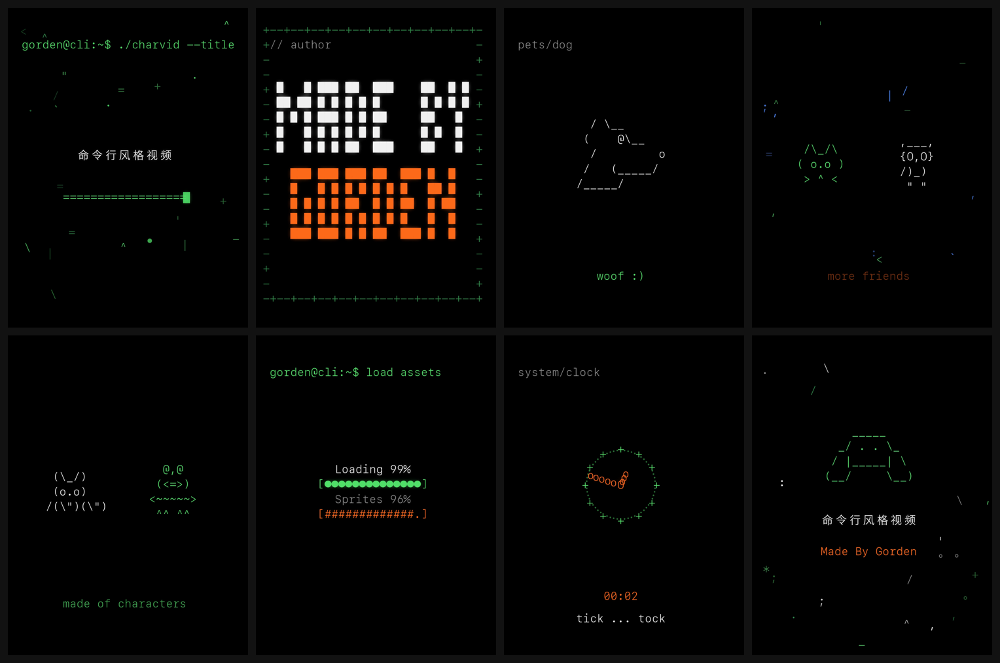
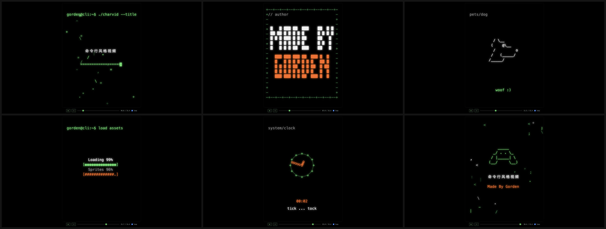

# asciivideo

> Make command-line / terminal-style **character animations** — text, creatures,
> logos and mascots built entirely out of ASCII & keyboard symbols on a black
> phosphor-glow canvas — and render them deterministically to **MP4** or a
> single self-contained **HTML** file.

<p align="center">
  
</p>

Inspired by Studio Dumbar's OpenAI DevDay "code-feel" visual system:
**black canvas, glowing monospace glyphs, restrained one-idea-per-scene pacing.**

- 🎬 **Two outputs, one script** — render to `.mp4` (ffmpeg) *or* export a
  single double-clickable `.html` that plays in the browser with controls.
- 🟩 **Phosphor terminal aesthetic** — black background, green/white/orange/blue
  glyphs, additive glow.
- 🧩 **78 built-in sprites** in 5 categories — or draw/register your own ASCII art.
- ✨ **Restrained animations** — typewriter, scatter-assemble, scramble-decode,
  wipe, fade, blink, bob; plus loading bars, particle fields, borders, an analog
  clock and timers.
- 中文 **CJK supported out of the box** — Chinese characters auto-fallback to a
  CJK font and occupy 2 grid cells.
- 🔁 **Deterministic** — same script → same output.

## Preview

| Sprite library (78) | Video frames | Live HTML (with controls) |
|---|---|---|
|  |  |  |

A live, self-contained demo is committed at [`docs/demo.html`](docs/demo.html) —
download and open it in any browser, or
[**preview it online**](https://htmlpreview.github.io/?https://github.com/GordenSun/asciivideo/blob/main/docs/demo.html).

## Requirements

- Python 3.9+
- [Pillow](https://python-pillow.org/) + [numpy](https://numpy.org/) — `pip install -r requirements.txt`
- [ffmpeg](https://ffmpeg.org/) on `PATH` — **only needed for MP4 export** (HTML export needs neither ffmpeg nor any runtime)

```bash
git clone https://github.com/GordenSun/asciivideo.git
cd asciivideo
pip install -r requirements.txt
```

## Quick start

```python
from charvid import Movie, palette as P

m = Movie(width=1080, height=1440, fps=30, font_size=46)   # vertical / social
s = m.scene(4.0)
s.border(symbol="|§|", color=P.GREEN_DIM, glow=0.55)
s.sprite("bunny", color=P.WHITE, idle="blink", anim_in="scatter")
s.text("just arrange the symbols", cy=20, color=P.GREEN, anim_in="fade",
       start=1.5, dur=2.0)

m.render("out.mp4")          # -> MP4 video (needs ffmpeg)
m.to_html("out.html")        # -> single self-contained HTML (no ffmpeg)
```

Run the bundled examples (they branch on the output extension):

```bash
python examples/demo.py            out.mp4         # 6-scene English reference
python examples/cli_style_video.py out.html        # 8-scene Chinese piece -> HTML
python examples/cli_style_video.py out.mp4 fps=15 preset=ultrafast   # quick preview
```

## Figures: pick one, or invent one

**Pick from the library** (78 sprites: `animal` 36 · `face` 9 · `object` 19 ·
`nature` 6 · `tech` 8):

```python
s.sprite("dog")
s.sprite("cat", idle="blink")          # faces with eyes can blink
```

Browse them in [`reference/gallery.png`](reference/gallery.png) (visual grid) and
[`reference/gallery.md`](reference/gallery.md) (name + description + ASCII), or
query `sprites.names_by_category()` / `sprites.info("dog")`.

**Or draw a brand-new figure** with `custom_sprite` (any multi-line ASCII art,
optional blink frame), and register it for reuse:

```python
s.custom_sprite(r'''
 (o_o)
<(   )>
 / \
''', blink=r'''
 (-_-)
<(   )>
 / \
''', idle="blink", color=P.ORANGE)

from charvid import sprites
sprites.register("mascot", art="...", blink="...", desc="my mascot")
```

Refresh the gallery after adding sprites: `python scripts/gallery.py`.

## Use as a Cursor / Claude Code skill

This repo doubles as an Agent Skill (see [`SKILL.md`](SKILL.md)). Install it by
copying the folder into your skills directory:

```bash
cp -r asciivideo ~/.cursor/skills/asciivideo      # Cursor
cp -r asciivideo ~/.claude/skills/asciivideo      # Claude Code
```

Then an agent can be asked for an "ASCII / 字符 / terminal-style animation" and
will use this engine.

## Project layout

```
asciivideo/
├── charvid/        # Python engine (canvas, elements, sprites, movie, webexport)
├── web/            # charvid.js (Canvas 2D runtime) + HTML template
├── examples/       # demo.py, cli_style_video.py
├── scripts/        # install_fonts.py, gallery.py
├── reference/      # sprites.md, recipes.md, gallery.md, gallery.png
├── docs/           # README assets + live demo.html
└── SKILL.md        # Cursor/Claude skill manifest
```

More: [`reference/sprites.md`](reference/sprites.md) (figures guide) ·
[`reference/recipes.md`](reference/recipes.md) (scene recipes).

## License

[MIT](LICENSE) — free for personal **and commercial** use. Attribution
appreciated but not required.

## Credits

Visual language inspired by Studio Dumbar's OpenAI DevDay identity. Built with
Pillow, numpy and ffmpeg.
