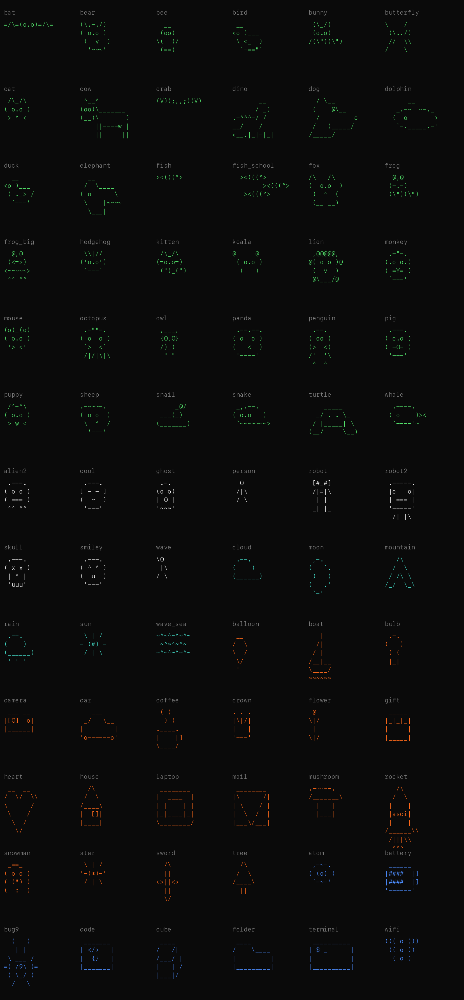

# Sprite gallery (auto-generated)

Run `python scripts/gallery.py` to refresh. Visual grid: 

Use `s.sprite("name")`. Faces marked (blink) support `idle="blink"`.

## animal (36)

**bat** — 蝙蝠
```
=/\=(o.o)=/\=
```

**bear** — 小熊 (blink)
```
(\.-./)
( o.o )
 (  v  )
  '~~~'
```

**bee** — 蜜蜂 (blink)
```
  __
 (oo)
\(  )/
 (==)
```

**bird** — 小鸟
```
 __     
<o )___ 
 \ <_  )
  `-=="`
```

**bunny** — 兔子 (blink)
```
 (\_/) 
 (o.o) 
/(\")(\")
```

**butterfly** — 蝴蝶
```
\    /
 (\../)
 //  \\
/    \
```

**cat** — 猫 (blink)
```
 /\_/\ 
( o.o )
 > ^ < 
```

**cow** — 奶牛 (blink)
```
 ^__^
(oo)\_______
(__)\       )
    ||----w |
    ||     ||
```

**crab** — 螃蟹
```
(V)(;,,;)(V)
```

**dino** — 恐龙
```
       __
      / _)
.-^^^-/ /
__/    /
<__.|_|-|_|
```

**dog** — 小狗(侧面)
```
  / \__   
 (    @\__ 
  /         o
 /   (_____/ 
/_____/      
```

**dolphin** — 海豚
```
      __
   _.-~  ~-._
  (  o       >
   `-._____.-'
```

**duck** — 鸭子
```
  __
<o )___
 ( ._> /
  `---'
```

**elephant** — 大象 (blink)
```
  __
 /  \____
( o      \
 \    |~~~~
  \___|
```

**fish** — 小鱼
```
><(((°>
```

**fish_school** — 鱼群
```
  ><(((°>      
        ><(((°> 
   ><(((°>     
```

**fox** — 狐狸 (blink)
```
/\   /\
(  o.o  )
 )  ^  (
 (__ __)
```

**frog** — 青蛙 (blink)
```
  @,@  
 (-.-) 
 (\")(\")
```

**frog_big** — 大青蛙(带腿) (blink)
```
  @,@  
 (<=>)
<~~~~~>
 ^^ ^^ 
```

**hedgehog** — 刺猬 (blink)
```
 \\|//
('o.o')
 `---`
```

**kitten** — 小猫脸 (blink)
```
 /\_/\
(=o.o=)
 (")_(")
```

**koala** — 考拉 (blink)
```
@     @
 ( o.o )
  (   )
```

**lion** — 狮子 (blink)
```
 ,@@@@@,
@( o o )@
 (  v  )
 @\___/@
```

**monkey** — 猴子 (blink)
```
 .-"-.
(.o o.)
( =Y= )
 `---'
```

**mouse** — 老鼠 (blink)
```
(o)_(o)
( o.o )
 '> <'
```

**octopus** — 章鱼 (blink)
```
 .-""-.
( o  o )
 `>  <`
 /|/|\|\
```

**owl** — 猫头鹰 (blink)
```
 ,___, 
 {O,O} 
 /)_)  
  " "  
```

**panda** — 熊猫 (blink)
```
 .--.--.
( o  o )
(   <  )
 '----'
```

**penguin** — 企鹅 (blink)
```
 .--.
( oo )
(>  <)
/'  '\
 ^  ^
```

**pig** — 小猪 (blink)
```
 .---.
( o.o )
( -O- )
 '---'
```

**puppy** — 小狗脸 (blink)
```
 /^-^\
( o.o )
 > w <
```

**sheep** — 绵羊 (blink)
```
.-~~~-.
( o o  )
 \  ^  /
  '---'
```

**snail** — 蜗牛
```
     _@/  
 ___(_)   
(_______) 
```

**snake** — 蛇 (blink)
```
 _,.--.
( o.o   )
 `~~~~~~~>
```

**turtle** — 乌龟 (blink)
```
    _____    
  _/ . . \_  
 / |_____| \ 
(__/     \__)
```

**whale** — 鲸鱼
```
  .----.
 ( o    )><
  `----'~
```

## face (9)

**alien2** — 外星人 (blink)
```
 .---.
( o o )
( === )
 ^^ ^^
```

**cool** — 墨镜酷脸
```
 .---.
[ - - ]
(  ~  )
 '---'
```

**ghost** — 幽灵
```
 .-. 
(o o)
| O |
'~~~'
```

**person** — 小人(站立)
```
  O
 /|\
 / \
```

**robot** — 机器人 (blink)
```
 [#_#] 
 /|=|\ 
  | |  
 _| |_ 
```

**robot2** — 方头机器人 (blink)
```
 .-----.
 |o   o|
 | === |
 '-----'
  /| |\
```

**skull** — 骷髅头
```
 .---.
( x x )
 | ^ |
 'uuu'
```

**smiley** — 笑脸 (blink)
```
 .---.
( ^ ^ )
(  u  )
 '---'
```

**wave** — 挥手的小人
```
\O
 |\
/ \
```

## nature (6)

**cloud** — 云
```
 .--.
(    )
(______)
```

**moon** — 月亮
```
 ,-.
(   `.
 )   )
(   .'
 `-'
```

**mountain** — 山
```
   /\
  /  \
 / /\ \
/_/  \_\
```

**rain** — 雨云
```
 .--.
(    )
(______)
 ' ' '
```

**sun** — 太阳
```
 \ | /
- (#) -
 / | \
```

**wave_sea** — 海浪
```
~^~^~^~^~
 ~^~^~^~
~^~^~^~^~
```

## object (19)

**balloon** — 气球
```
 __
/  \
\  /
 \/
 '
```

**boat** — 帆船
```
   |
  /|
 / |
/__|__
\____/
~~~~~~
```

**bulb** — 灯泡
```
 .-.
(   )
 ) (
 |_|
```

**camera** — 相机
```
 ___ __
|[O]  o|
|______|
```

**car** — 汽车
```
   ___
 _/   \__
|        |
'o------o'
```

**coffee** — 咖啡杯
```
 ( (
  ) )
.____.
|    |]
\____/
```

**crown** — 皇冠
```
. . .
|\|/|
|   |
'---'
```

**flower** — 花
```
 @
\|/
 |
\|/
```

**gift** — 礼物盒
```
 _____
|_|_|_|
|     |
|_____|
```

**heart** — 爱心
```
 __  __ 
/  \/  \\
\      /
 \    / 
  \  /  
   \/   
```

**house** — 房子
```
  /\
 /  \
/____\
|  []|
|____|
```

**laptop** — 笔记本电脑
```
 ________
|  ____  |
| |    | |
|_|____|_|
\________/
```

**mail** — 信封
```
 ________
|\      /|
| \    / |
|  \  /  |
|___\/___|
```

**mushroom** — 蘑菇
```
.-~~~-.
/_______\
  |   |
  |___|
```

**rocket** — 火箭
```
   /\   
  /  \  
 |    | 
 |asci| 
 |    | 
/______\\
 /|||\\ 
  ^^^   
```

**snowman** — 雪人 (blink)
```
 _==_
( o o )
( (") )
(  :  )
```

**star** — 星星
```
 \ | /
'-(*)-'
 / | \
```

**sword** — 剑
```
  /\
  ||
<>||<>
  ||
  \/
```

**tree** — 松树
```
  /\
 /  \
/____\
  ||
```

## tech (8)

**atom** — 原子
```
 ,-~-.
( (o) )
 `-~-'
```

**battery** — 电池
```
 ______
|####  |]
|####  |]
'------'
```

**bug9** — 9号瓢虫吉祥物
```
  (   )  
   | |   
 \ ___ / 
=( /9\ )=
 ( \_/ ) 
  /   \  
```

**code** — 代码框
```
 _______
| </>   |
|  {}   |
|_______|
```

**cube** — 立方体
```
 ____
/   /|
/___/ |
|   | /
|___|/
```

**folder** — 文件夹
```
 ____
/    \____
|         |
|_________|
```

**terminal** — 终端窗口
```
 __________
| $ _      |
|          |
|__________|
```

**wifi** — WiFi 信号
```
((( o )))
 (( o ))
  ( o )
```
